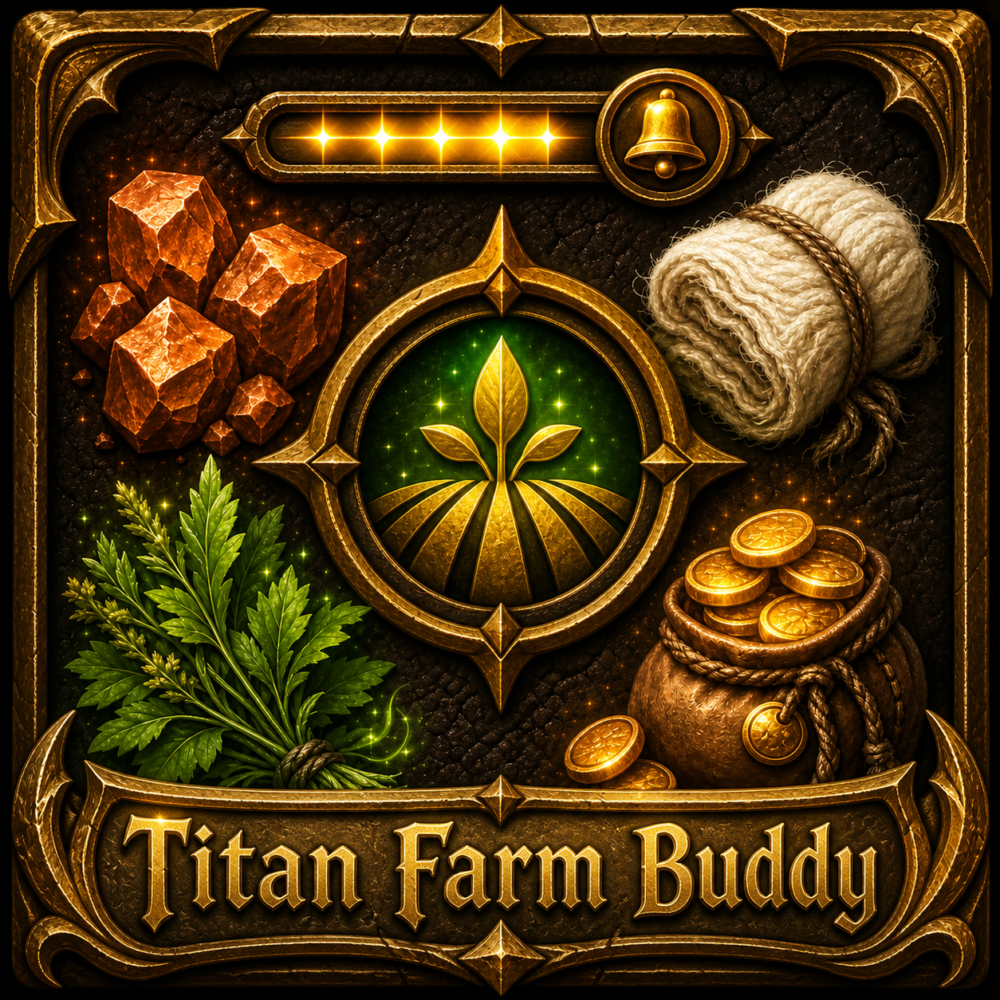

# Titan-Panel-Farm-Buddy

  

A World of Warcraft AddOn that extends the famous Titan Panel with the functionality to Track up to four Farmed Items in the Titan Panel Bar. A notification will appear if the defined goal quantity for an item has reached.

**Quickstart**  
Alt + Right-click on an Item in your Bags or Bank to start tracking.
You can also enter the name of the desired Item in the AddOn settings.

**Features**  
* Track up to 16 farmed Items in the Titan Panel Bar
* Track inventory or inventory and bank quantity
* Show item icon in the Titan Panel Bar
* Define an optional quantity for the farmed item
* Shows a notification if the item quantity has reached
* Select an optional sound for the notification
* Customize notification effects
* Show colored item count and quantity
* Localized (English and German)
* Define a shortcut for fast tracking (Default: ALT + right click)
* Toggle item display modes

**Please note:** Through the limitation of the API functions it is currently only possible to track known items by name. That means the items have to be in your data cache (Inventory or Bank)
The item name will be validated if you set it if the item name is invalid or not known by the API you will see a notification.

**Chat Commands**  
* /fb track < Item Slot 1-16 > < Item ID | Item Name | Item Link > - Sets the tracked item.
* /fb quantity < Item Slot 1-16 > < Quantity > - Sets the goal quantity.
* /fb primary < Item Slot 1-16 > - Sets the items position that would be shown in the Titan Panel bar.
* /fb reset < all | items > - Resets Farm Buddy to its default settings.
* /fb settings - Open up the AddOn settings page.
* /fb version - Show the current used Farm Buddy Version.
* /fb help - Shows the available chat commands.

**Bug Reports and Feature Requests**  
Please use the [CurseForge](https://wow.curseforge.com/projects/titan-panel-farm-buddy/issues) ticketing systems to submit bug reports and feature requests.

---
# Links
**Github:** https://github.com/KeldorDE/Titan-Panel-Farm-Buddy  
**Curse:** https://mods.curse.com/addons/wow/274538-titan-panel-farm-buddy  
**CurseForge:** https://wow.curseforge.com/projects/titan-panel-farm-buddy

---
# Usefully Links for Development
**World of Warcraft Icon List:** http://www.wowhead.com/icons  
**WowAce Documentation:** https://www.wowace.com/projects/ace3/pages/  
**AddOn API Documentation:**
* http://wowwiki.wikia.com/wiki/Category:World_of_Warcraft_API
* https://wow.gamepedia.com/World_of_Warcraft_API
* https://www.townlong-yak.com/framexml/live
